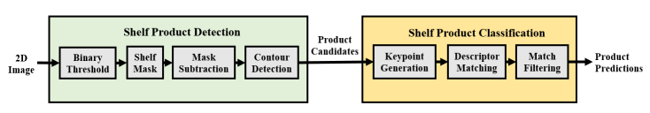

## Overview
The retail_recognition package is a package that both detects and classifies environmental context found in retail stores. In this implementation, algorithms have been developed to detect & classify aisle sign text and shelf products.

## Dependencies

### System
- Ubuntu 14.04
- ROS-Indigo
- OpenCV 2.4.X

### Package
The following package dependencies are required:
- Tesseract: https://github.com/tesseract-ocr/tesseract
- Hunspell: https://github.com/hunspell/hunspell
- OpenCV Nonfree: https://docs.opencv.org/2.4/modules/nonfree/doc/nonfree.html

## Aisle Sign Recognition
The following pipeline first detects sign labels on the aisle sign and then classifies the text found on each label.

Upon startup, this node loads a [textfile](databases/aisle_signs/sign_label_list1.txt) containing known sign label product categories into memory. The product categories are saved in a list designated as the "sign label database". Additionally, each sign label is parsed into individual words and then saved into a similar "word database".

This node first subscribes to the camera topic published by the usb_cam node. Canny edge detection [1] is performed on a binarized version of the raw image, with the goal of capturing contours corresponding to individual sign label borders located on the aisle sign. For each captured contour, the raw image is first deskewed using a perspective transform and then cropped along the sign label's borders. Finally, the cropped images are binarized as a pre-processing step for the text classification process.

The Tesseract-OCR libary is used to make initial text predictions for each cropped sign label. A spell-checking step is employed, where the Tesseract-OCR predictions are compared to the word database entries using the Levenshtein distance metric [2]. An OCR word is replaced by a database word if their Levenshtein distance is minimal. After the spell-checking process is completed, the node searches through the sign label database to find a match with the spell-checked prediction. If a match is found, the sign label's text and original skewed bounding box are displayed in the raw image.

## Shelf Product Recognition
The shelf product recognition node also uses a two-step detection / classification process.

This node first loads into memory a [textfile](databases/products/product_list1.txt) that contains information related to product categories and names located in a specific aisle. [Product template images](databases/products/template_images) corresponding to the product names listed in the textfile are then imported, creating a database of product images.

As with aisle sign recognition, this node subscribes to the usb_cam node's camera topic. The detection process begins by removing the shelving background from the image. To do this, the raw image is binarized, from which a mask of the shelving features is created. This shelving mask is subtracted from the oiginal binary image, leaving a resultant image that only contains product shapes. Bounding boxes are generated around these shapes using a contour detector, which are then used to crop detected products from the raw image.

Product candidates are classified using SIFT feature maching [3], where each product candidate is matched to every template image in the aisle's product database. Outlier matches in each candidate-template pair are removed using both the ratio test [3] and RANSAC [4]. The template image with the most matches to the product candidate is assigned as the candidate's classification label. Bounding boxes and classification labels are displayed in the raw image, as shown in the example below:

## References
[1]: J. Canny, “A Computational Approach to Edge Detection,” IEEE Trans. Pattern Anal. Mach. Intell., vol. PAMI-8, no. 6, pp. 679–698, 1986.

[2]: G. V. Bard, “Spelling-error tolerant, order-independent pass-phrases via the DamerauLevenshtein string-edit distance metric,” Conf. Res. Pract. Inf. Technol. Ser., vol. 68, pp.117–124, 2007.

[3]: D.G. Lowe, “Distinctive Image Features from Scale-Invariant Keypoints,” Int. J. Comput. Vis., vol. 60, no. 2, pp. 91–110, 2004.

[4]: M. a Fischler and R. C. Bolles, “Random Sample Consensus: A Paradigm for Model Fitting with,” Commun. ACM, vol. 24, pp. 381–395, 1981.  

